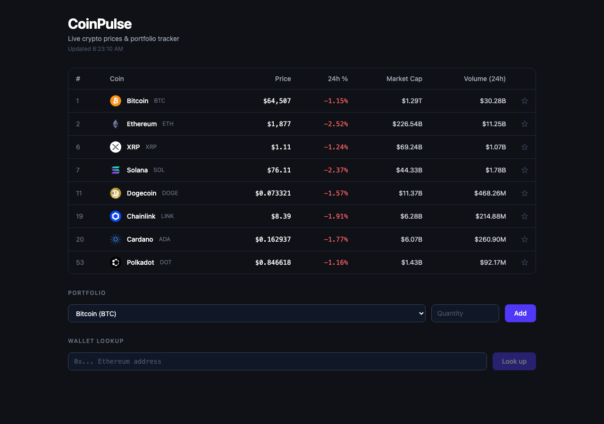
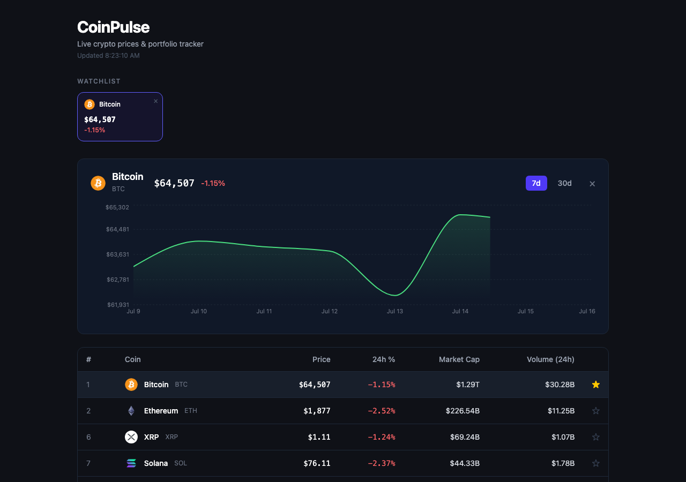
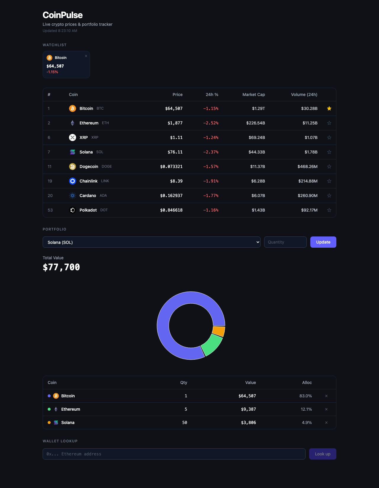

# CoinPulse

A full-stack cryptocurrency portfolio and price dashboard. Live prices refresh automatically every 60 seconds. Build a personal watchlist, track your holdings with an allocation chart, and look up the ETH balance of any public Ethereum wallet.



## Features

- **Live price ticker** — 8 coins with rank, price, 24h % change (green/red), market cap, and volume, auto-refreshed every 60 seconds
- **Historical chart** — click any coin or watchlist card to open a 7d/30d price area chart powered by Recharts
- **Watchlist** — star any coin to pin it to a card strip above the ticker; click a card to toggle its chart
- **Portfolio tracker** — enter your holdings, see total USD value and a live donut chart showing allocation across all positions
- **Wallet lookup** — paste any public Ethereum address and instantly see its ETH balance and USD equivalent





## Tech stack

| Layer | Technology |
|---|---|
| Frontend | React 19, Vite, Tailwind CSS v4, Recharts |
| Backend | Python 3.11, FastAPI, httpx, uvicorn |
| Data | CoinGecko Demo API (markets + chart), Etherscan API (wallet balance) |
| Tests | vitest + @testing-library/react (frontend), pytest + pytest-asyncio (backend) |

## Getting started

### Prerequisites

- Node.js 18+
- Python 3.11+
- A [CoinGecko Demo API key](https://www.coingecko.com/en/api) (free)
- An [Etherscan API key](https://etherscan.io/apis) (free, required for wallet lookup)

### 1. Clone and configure

```bash
git clone <repo-url>
cd CoinC
```

Create `backend/.env`:

```
COINGECKO_API_KEY=your_coingecko_key_here
ETHERSCAN_API_KEY=your_etherscan_key_here
```

### 2. Start the backend

```bash
cd backend
python -m venv .venv
source .venv/bin/activate       # Windows: .venv\Scripts\activate
pip install -r requirements.txt
uvicorn main:app --reload
```

Backend runs on **http://localhost:8000**.

### 3. Start the frontend

```bash
cd frontend
npm install
npm run dev
```

App runs on **http://localhost:5173**. Vite proxies `/api` → `localhost:8000`.

### 4. Run the tests

```bash
# Backend (from backend/)
python -m pytest tests/ -v

# Frontend (from frontend/)
npm test
```

## Architecture

```
backend/
  config.py            # Frozen Settings dataclass — single source of env vars
  coingecko_client.py  # HTTP transport for CoinGecko (SRP)
  coin_service.py      # Domain logic: validation, coin ID allow-list (SRP)
  etherscan_client.py  # HTTP transport for Etherscan (SRP)
  wallet_service.py    # Address validation, wei → ETH conversion (SRP)
  main.py              # FastAPI routes + dependency injection (DIP)
  tests/               # 24 pytest unit tests

frontend/
  src/
    services/          # CoinApiService — single fetch layer, all URLs here
    utils/             # PriceFormatter — all formatting logic, no duplication
    hooks/             # 5 custom hooks own all state and side effects
    components/        # 5 presentational components, no fetch calls inside
  src/__tests__/       # 55 vitest unit tests
```

Each layer depends only on the layer below it. Route handlers call services; services call clients; clients call the network. Components call hooks; hooks call the service. No layer skips a level.

## API endpoints

| Method | Path | Description |
|---|---|---|
| GET | `/markets` | Live market data for all 8 tracked coins |
| GET | `/coins/{id}/chart` | Historical price data (7d or 30d) for one coin |
| GET | `/wallet/{address}` | ETH balance for any public Ethereum address |
